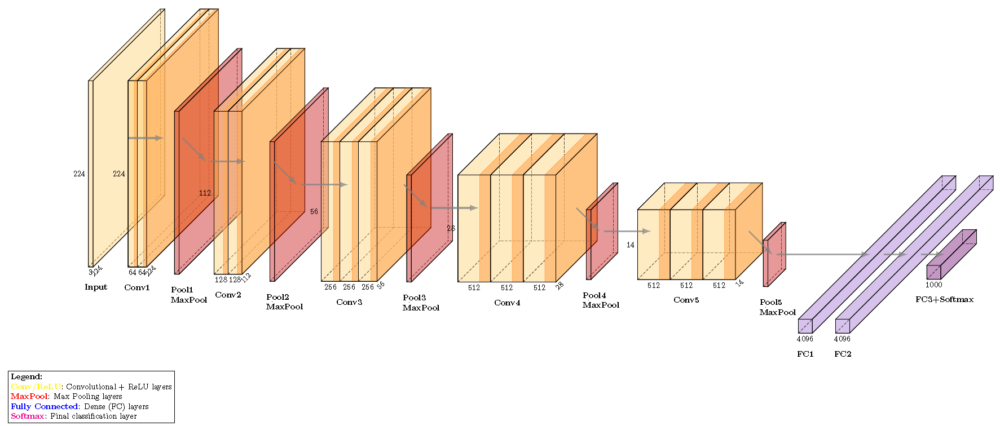
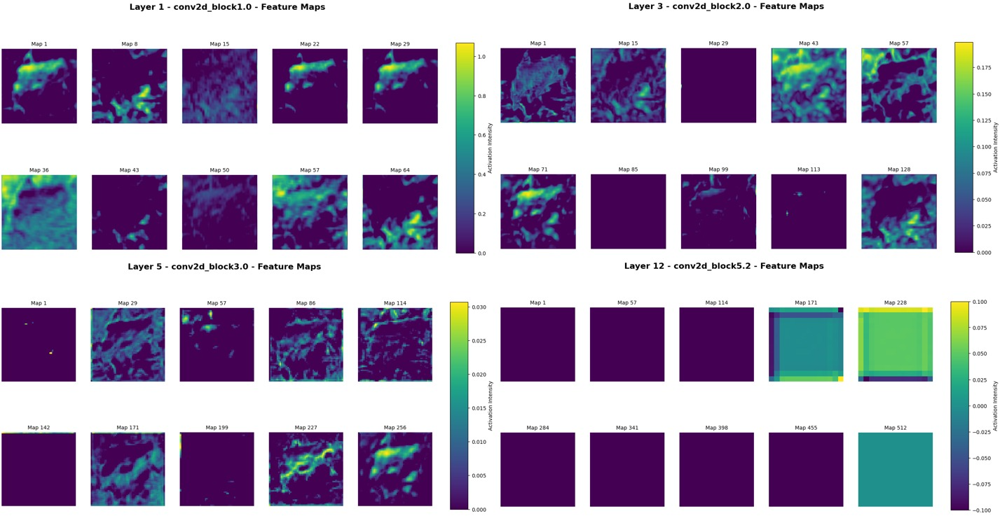

# **Very Deep Convolutional Networks for Large-Scale Image Recognition**

Cite- https://doi.org/10.48550/arXiv.1409.1556 , Simonyan and Zisserman (2015)

🌟 deepcnn4cifar 🌟
This repository implementing deep convolutional neural networks for the CIFAR-10 dataset. This project demonstrates training, evaluation, and visualization of deep learning models for image classification. Dive in to explore the world of computer vision with powerful tools and stunning visualizations.

_VGG16 Architecture:_


**Project Structure:**

```
deepcnn4cifar/
├── assets/
│   ├── PlotNeuralNet/         # LaTeX resources for neural network visualization
│   ├── vgg11_template.tex     # LaTeX template for VGG11 architecture
│   ├── vgg16_template.tex     # LaTeX template for VGG16 architecture
├── src/
│   ├── core/                  # Core model and configuration files
│   │   ├── config.py          # Configuration settings
│   │   ├── model.py           # Model definitions
│   │   ├── gradcam.py         # Implementation of Grad-CAM
│   ├── scripts/               # Main scripts for training, evaluation, and visualization
│   │   ├── train.py           # Training script
│   │   ├── evaluate.py        # Evaluation script
│   │   ├── visualize.py       # Visualization script
│   ├── utils/                 # Utility scripts for loading data and models
│       ├── load_data.py       # Data loading utilities
│       ├── load_model.py      # Pre-trained model utilities
├── tests/                     # Unit tests for the project
├── .gitmodules                # Git submodules configuration
├── .gitignore                 # Git ignore rules
├── README.md                  # This file
```

🚀 **Features**

🎨 Visualizations
Our visualizations provide detailed insights into training and evaluation. Below is an example of a training accuracy vs. epochs chart:



We also include confusion matrices for evaluating model performance:


You can easily adjust the depth and parameters of the vggs in core/model.py.
Utilize scripts/visualize.py to generate interactive charts and matrices.
Track and compare model accuracy and loss metrics with detailed graphs.

**How To Use:**

1. Clone the Repository
   `git clone https://github.com/yourusername/deepcnn4cifar.git`
   `cd deepcnn4cifar`
2. Install Dependencies
   `pip install -r requirements.txt`
   Ensure LaTeX is installed for generating architecture diagrams:
   `pdflatex --version`

3. Train a model on CIFAR-10 using:
   `python scripts/train.py`

4. Evaluate the Model
   `python scripts/evaluate.py`

5. Visualize Results
   `python scripts/visualize.py`

References:
CIFAR-10 Dataset: A dataset of 60,000 32x32 color images in 10 classes.
Deep Learning Framework: Built using PyTorch/TensorFlow.
Paper : "Very Deep Convolutional Networks for Large-Scale Image Recognition" (Simonyan & Zisserman, 2015).
