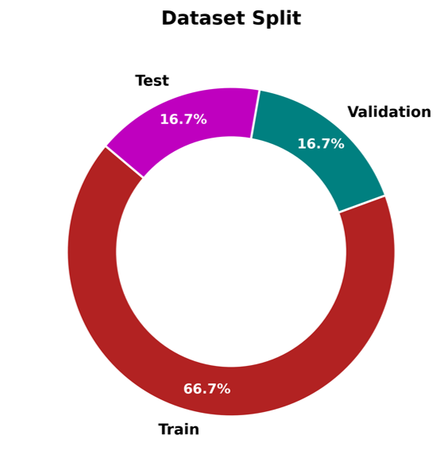
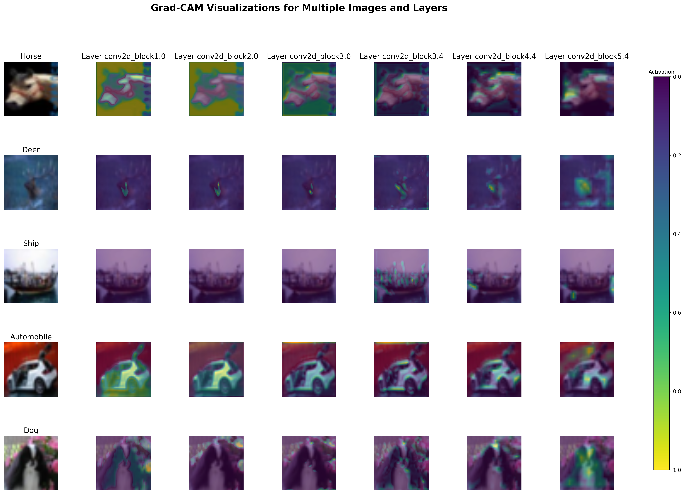

# **Very Deep Convolutional Networks for Large-Scale Image Recognition**

[](LICENSE)  
[](https://www.robots.ox.ac.uk/~vgg/publications/2015/Simonyan15/)  

**deepcnn4cifar** 
This repository implements deep convolutional neural networks for the CIFAR-10 dataset. The project demonstrates model training, evaluation, and visualization for image classification. The objective is to explore the performance of very deep networks and their impact on feature learning for computer vision tasks.


**Objectives & Hypothesis:**

- To implement deep convolutional neural networks (VGG architectures) for CIFAR-10.
- To evaluate model accuracy and error rates.
- To visualize feature activations, provide layered visual representation of data, analyze model interpretability, and generate Grad-CAM outputs.
- Hypothesis: Increasing model depth improves classification performance while maintaining computational efficiency.

**Assumptions:**
The CIFAR-10 dataset consists of 60,000 32x32 images classified into 10 categories.
Performance improvement depends on depth, regularization, and optimization techniques.
Using smaller convolutional filters (3x3) enhances feature learning.

# Project Structure:

```
deepcnn4cifar/
├── assets/                    # Resources for visualization
│   ├── PlotNeuralNet/         # LaTeX resources for neural network visualization
│   ├── vgg11_template.tex     # LaTeX template for VGG11 architecture
│   ├── vgg16_template.tex     # LaTeX template for VGG16 architecture
├── src/
│   ├── core/                  # Core model and configuration files
│   │   ├── config.py          # Configuration of model hyperparameters and settings
│   │   ├── model.py           # Model architecture definitions
│   │   ├── gradcam.py         # Implementation of Grad-CAM
│   ├── scripts/               # Main scripts for training, evaluation, and visualization
│   │   ├── train.py           # Training script
│   │   ├── evaluate.py        # Evaluation script
│   │   ├── visualize.py       # Visualization script
│   ├── utils/                 # Utility scripts for loading data and models
│       ├── load_data.py       # Data loading utilities
│       ├── load_model.py      # Pre-trained model utilities
├── tests/                     # Unit tests for the project
├── .gitmodules                # Git submodules configuration
├── pyproject.toml             # Contains core libraries for the project
├── README.md                  # This file

```

# Key stages of the project
1. Data import: Load CIFAR-10 dataset and perfrom initial exploratory data analysis.

_CIFAR 10 Data Examples:_


2. Data Processing:Normalize images, Convert data into PyTorch tensors and create data loaders. 

3. Model Training: Implement VGG-11 and VGG-16 architectures. Train models using cross-entropy loss. Include learning rate scheduling and dropout for regularization.

_Data Division:_



_VGG Architecture:_


4. Evalutation and Analysis: Compute accuracy, precision, recall, and F1-score, Visualize loss and accuracy trends, Generate confusion matrices.

 **Model Performance:**

| Model  | Accuracy | Precision | Recall | F1 Score |
|--------|----------|-----------|--------|----------|
| VGG11  | 81.61%   | 81.76%    | 81.61% | 81.61%   |
| VGG16  | 84.74%   | 84.76%    | 84.74% | 84.73%   |


5. Visualization:
- Visualize CIFAR-10 dataset images with class labels.
- Show image transformations before and after processing.
- Display top-5 model prediction errors.
- Generate Grad-CAM heatmaps for model interpretation.
- Analyze dataset splits and distributions.
- Illustrate VGG network architecture.

Our visualizations provide detailed insights into training and evaluation. Below is an example of a _training accuracy vs. epochs_ chart:_


_ROC Curve:_


We also include _Confusion Matrices_ for evaluating model performance:


_Top 5 common mistakes made by the model (1 example per category):_


And _Grad-CAM: Visualizing Model Decisions_
Grad-CAM (Gradient-weighted Class Activation Mapping) reveals which image regions influenced a model’s prediction. The figure below applies Grad-CAM to CIFAR-10 images using VGG16, showing original images (left) and activation heatmaps from different layers (right). Warmer colors indicate higher importance.:




**Important Definitions & Key Parameters**

- Learning Rate: Controls the step size during weight updates.
- Batch Size: Number of training samples per iteration.
- Dropout Rate: Percentage of units dropped during training for regularization.
- Epochs: Number of complete passes through the training dataset.

You can easily adjust the depth and parameters of the vggs in src/core/model.py.
Utilize scripts/visualize.py to generate interactive charts and matrices.
Track and compare model accuracy and loss metrics with detailed graphs.

# How To Use:

1. **Clone the Repository**  
   `git clone https://github.com/yourusername/deepcnn4cifar.git`  
   `cd deepcnn4cifar`  

2. **Install Virtualenv and Create a Virtual Environment**  
   Install `virtualenv` if you don't have it already:  
   `pip install virtualenv`  

   Create a virtual environment:  
   `python3.12 -m venv venv`  

   Activate the virtual environment:  
   `source venv/bin/activate`  
   *(You should see `(venv)` as a prefix to all commands after activation)*  

   Update `pip` to the latest version:  
   `python3 -m pip install --upgrade pip`

3. **Install Project Dependencies**  
   Install the required packages for the project: <br>
   `pip install -e .`  

5. **Install Development Dependencies (Optional)**  
   Install additional packages for linting, testing, and other developer tools:  
   `pip install -e .[dev] #.'[dev]' for MacOS`  

6. **Run Training & Evaluation Pipelne**  
   To run the train and evaluation pipeline, run the following command:  
   `python main.py`  

7. **Visualize Results (with GradCam)**  
   To visualize results using GradCam on an image, run:  
   `python -m src.scripts.visualize --task gradcam --output_path outputs/gradcam_results.png`

<br>
Note: All relevant settings and hyperparams can be modified under src/core/config.py
<br>

# Unit Tests:
Ensure you have dev dependencies (i.e., pytest) installed:<br>
   `pip install .[dev] # '.[dev]' for MacOS`<br>

To run unit tests for data and model loading, simply run: <br>
   `pytest`<br>


# References:
*CIFAR-10 Dataset*: A dataset of 60,000 32x32 color images, 10 classes, 6,000 images per class. Link- https://www.cs.toronto.edu/~kriz/cifar.html <br>
*Deep Learning Framework*: Built using PyTorch/TensorFlow. <br>
Paper : Simonyan, K., & Zisserman, A. (2015). "Very Deep Convolutional Networks for Large-Scale Image Recognition". ICLR 2015. Link- https://arxiv.org/abs/1409.1556 

