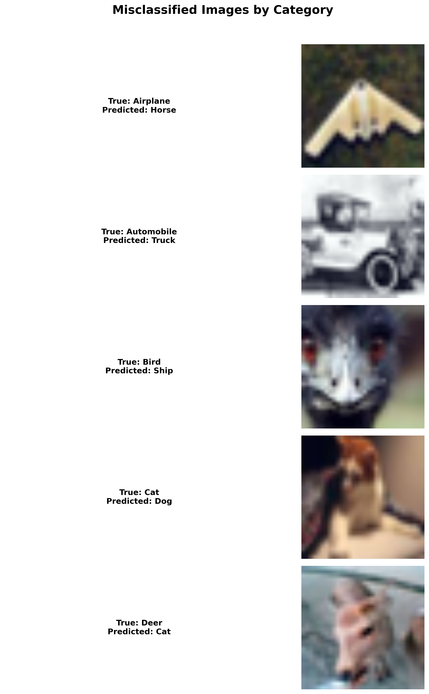

# **Very Deep Convolutional Networks for Large-Scale Image Recognition**

[](LICENSE)  
[](https://www.robots.ox.ac.uk/~vgg/publications/2015/Simonyan15/)  

**deepcnn4cifar** 
This repository implementing deep convolutional neural networks for the CIFAR-10 dataset. This project demonstrates training, evaluation, and visualization of deep learning models for image classification. Dive in to explore the world of computer vision with powerful tools and stunning visualizations.

_CIFAR 10 Data Examples:_


_Data division:_


_VGG Architecture:_


**Project Structure:**

```
deepcnn4cifar/
├── assets/
│   ├── PlotNeuralNet/         # LaTeX resources for neural network visualization
│   ├── vgg11_template.tex     # LaTeX template for VGG11 architecture
│   ├── vgg16_template.tex     # LaTeX template for VGG16 architecture
├── src/
│   ├── core/                  # Core model and configuration files
│   │   ├── config.py          # Configuration settings
│   │   ├── model.py           # Model definitions
│   │   ├── gradcam.py         # Implementation of Grad-CAM
│   ├── scripts/               # Main scripts for training, evaluation, and visualization
│   │   ├── train.py           # Training script
│   │   ├── evaluate.py        # Evaluation script
│   │   ├── visualize.py       # Visualization script
│   ├── utils/                 # Utility scripts for loading data and models
│       ├── load_data.py       # Data loading utilities
│       ├── load_model.py      # Pre-trained model utilities
├── tests/                     # Unit tests for the project
├── .gitmodules                # Git submodules configuration
├── pyproject.toml             # Contains core libraries for the project
├── README.md                  # This file

```
 **Model Performance**

| Model  | Accuracy | Precision | Recall | F1 Score |
|--------|----------|-----------|--------|----------|
| VGG11  | 81.61%   | 81.76%    | 81.61% | 81.61%   |
| VGG16  | 84.74%   | 84.76%    | 84.74% | 84.73%   |


 **Features**

Visualizations
Our visualizations provide detailed insights into training and evaluation. Below is an example of a training accuracy vs. epochs chart:


ROC Curve:


We also include confusion matrices for evaluating model performance:


Top 5 common mistakes made by the model (1 example per category):



And Grad-CAM: Visualizing Model Decisions
Grad-CAM (Gradient-weighted Class Activation Mapping) reveals which image regions influenced a model’s prediction. The figure below applies Grad-CAM to CIFAR-10 images using VGG16, showing original images (left) and activation heatmaps from different layers (right). Warmer colors indicate higher importance.:


You can easily adjust the depth and parameters of the vggs in src/core/model.py.
Utilize scripts/visualize.py to generate interactive charts and matrices.
Track and compare model accuracy and loss metrics with detailed graphs.

# How To Use:

1. **Clone the Repository**  
   `git clone https://github.com/yourusername/deepcnn4cifar.git`  
   `cd deepcnn4cifar`  

2. **Install Virtualenv and Create a Virtual Environment**  
   Install `virtualenv` if you don't have it already:  
   `pip install virtualenv`  

   Create a virtual environment:  
   `python3 -m venv venv`  

   Activate the virtual environment:  
   `source venv/bin/activate`  
   *(You should see `(venv)` as a prefix to all commands after activation)*  

   Update `pip` to the latest version:  
   `python3 -m pip install --upgrade pip`

3. **Install Project Dependencies**  
   Install the required packages for the project:  
   `pip install -e .`  

4. **Install Development Dependencies (Optional)**  
   Install additional packages for linting, testing, and other developer tools:  
   `pip install -e .[dev]`  

5. **Run Training & Evaluation Pipelne**  
   To start training the model, run the following command:  
   `python -m main.py`  

7. **Visualize Results (with GradCam)**  
   To visualize results using GradCam on an image, run:  
   `python -m src.scripts.visualize.py --task gradcam --num_images 1 --output_path outputs/gradcam_results.png`

<br>
Note: All relevant settings and hyperparams can be modified under src/core/config.py
<br>

# Unit Tests:
To run unit tests for data and model loading, simply run: <br>
   `pytest`<br>


References:
CIFAR-10 Dataset: A dataset of 60,000 32x32 color images in 10 classes.
Deep Learning Framework: Built using PyTorch/TensorFlow.
Paper : "Very Deep Convolutional Networks for Large-Scale Image Recognition" (Simonyan & Zisserman, 2015).
